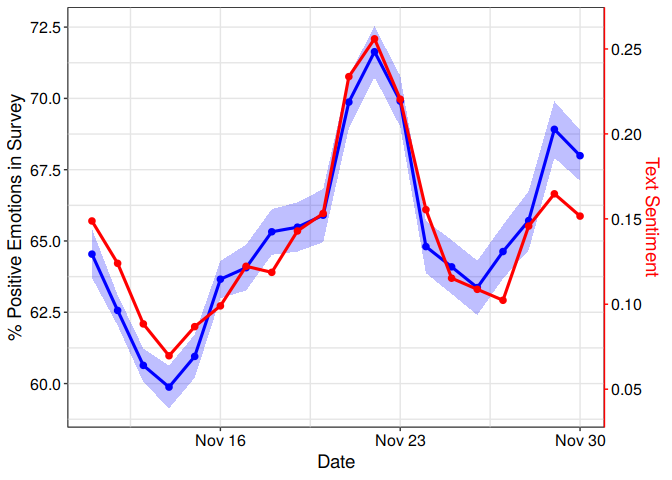
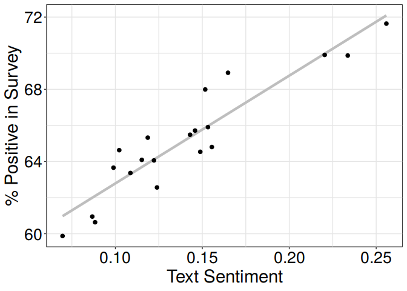
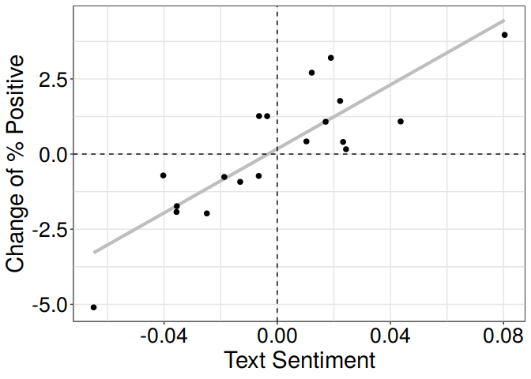

Validating social media macroscopes of emotions
================
Max Pellert, David Garcia
11 January, 2021

``` r
library(data.table) #data.table_1.13.0
library(ggplot2) #ggplot2_3.3.2 
library(lmtest) #lmtest_0.9-37   
library(dplyr) #dplyr_1.0.2
library(sandwich) #sandwich_2.5-1
library(boot) #boot_1.3-24
            
Sys.setlocale("LC_TIME", "en_US.UTF-8")
knitr::opts_chunk$set(echo=TRUE,warning=FALSE,message=FALSE)
```

``` r
theme_paper <- function(){
  theme_bw() %+replace%
    theme(
      axis.title = element_text(size = 14),
      axis.text = element_text(colour="black", size=12),
      panel.grid.major = element_line(colour = "grey90"),
      panel.grid.minor = element_line(colour="grey90"),
      panel.background = element_rect(fill = "white"),
      strip.background=element_rect(fill="white"))
}

theme_set(theme_paper())
```

``` r
pl <- read.csv("TSdata.csv")
sum(pl$Nsurvey[!is.na(pl$Nsurvey)])
```

    ## [1] 268128

``` r
sum(pl$Nposts)
```

    ## [1] 452013

``` r
pl$prop_good.n <- round(pl$prop_good*pl$Nsurvey)
pl$sent <- (pl$GS+pl$LIWC)/2
pl$date <- as.Date(pl$date)
pl <- as.data.table(pl)
```

``` r
bl <- lapply(3:nrow(pl),function(i) return(c(rep(1,pl[i,prop_good.n]),rep(0,pl[i,Nsurvey-prop_good.n]))))

meanfun <- function(data, indices){
  sum(data[indices])/length(data[indices])
}

blcis <- lapply(1:length(bl),function(x){
  
  bo <- boot(bl[[x]], statistic=meanfun, R=10000,parallel = "multicore",ncpus = 4)

  cis <- apply(bo$t,2, quantile, c(.025, 0.975))[,1]
  
})
saveRDS(blcis, file="SurveyCIs.RDS")
```

``` r
blcis <- readRDS("SurveyCIs.RDS")
pl$perc_good <- 100*pl$prop_good

mp <- lm(perc_good~sent,data=pl)
shift <- mp$coefficients[1]
scale <- mp$coefficients[2] 

cidt <- data.table(matrix(unlist(blcis),ncol=2,byrow=T))
setnames(cidt,c("cimin","cimax"))
cidt$cimin <- 100*cidt$cimin
cidt$cimax <- 100*cidt$cimax

ggplot(cbind(pl[date>=as.Date("2020-11-11")],cidt), aes(x=date)) +
  geom_line( aes(y=perc_good),size=1.1, color="blue") +
  geom_point(aes(y=perc_good), color="blue", size=2) + 
  geom_ribbon(aes(y=perc_good,ymin=cimin,ymax=cimax),alpha=0.25, bg="blue") +
  geom_line( aes(y=shift + scale*sent), color="red",size=1.1) +
  geom_point(aes(y= shift + scale*sent),color="red", size=2) +
  scale_y_continuous( name = '% Positive Emotions in Survey',
                      sec.axis = sec_axis(~ (.-shift)/scale, name="Text Sentiment",
                                          breaks=seq(0.05,0.25,0.05)), breaks=seq(60,75,2.5)) + 
  theme_paper() + theme(axis.line.y.right = element_line(color = "red"), 
                        axis.ticks.y.right = element_line(color = "red"), 
                        axis.title.y.right = element_text(color = "red")) + xlab("Date")
```

<!-- -->

``` r
cor.test(pl$prop_good,pl$sent)
```

    ## 
    ##  Pearson's product-moment correlation
    ## 
    ## data:  pl$prop_good and pl$sent
    ## t = 10.5, df = 18, p-value = 4.192e-09
    ## alternative hypothesis: true correlation is not equal to 0
    ## 95 percent confidence interval:
    ##  0.8218585 0.9712129
    ## sample estimates:
    ##       cor 
    ## 0.9271754

``` r
ggplot(pl, aes(x=sent,y=perc_good)) +
geom_smooth(method="lm", se=F, color="gray", lwd=1.5) + geom_point(size=2) + ylab('% Positive in Survey') +
  xlab("Text Sentiment") + theme(axis.title = element_text(size = 22),
      axis.text = element_text(colour="black", size=20))
```

<!-- -->

``` r
fitsen <- lm(prop_good ~ sent,data=na.omit(pl,cols=c("prop_good","sent")))

round(coeftest(fitsen, vcov=vcovHAC(fitsen)),3)
```

    ## 
    ## t test of coefficients:
    ## 
    ##             Estimate Std. Error t value  Pr(>|t|)    
    ## (Intercept)    0.568      0.011  53.154 < 2.2e-16 ***
    ## sent           0.597      0.063   9.523 < 2.2e-16 ***
    ## ---
    ## Signif. codes:  0 '***' 0.001 '**' 0.01 '*' 0.05 '.' 0.1 ' ' 1

``` r
round(coefci(fitsen, vcov=vcovHAC(fitsen)),3)
```

    ##             2.5 % 97.5 %
    ## (Intercept) 0.546  0.591
    ## sent        0.465  0.728

``` r
summary(fitsen)
```

    ## 
    ## Call:
    ## lm(formula = prop_good ~ sent, data = na.omit(pl, cols = c("prop_good", 
    ##     "sent")))
    ## 
    ## Residuals:
    ##        Min         1Q     Median         3Q        Max 
    ## -0.0165216 -0.0105770 -0.0005588  0.0053255  0.0226208 
    ## 
    ## Coefficients:
    ##             Estimate Std. Error t value Pr(>|t|)    
    ## (Intercept) 0.568199   0.008432   67.39  < 2e-16 ***
    ## sent        0.596803   0.056837   10.50 4.19e-09 ***
    ## ---
    ## Signif. codes:  0 '***' 0.001 '**' 0.01 '*' 0.05 '.' 0.1 ' ' 1
    ## 
    ## Residual standard error: 0.01221 on 18 degrees of freedom
    ## Multiple R-squared:  0.8597, Adjusted R-squared:  0.8519 
    ## F-statistic: 110.3 on 1 and 18 DF,  p-value: 4.192e-09

``` r
pl$difgood <- c(NA,diff(pl$perc_good))
pl$difsent <- c(NA,diff(pl$sent))

ggplot(pl, aes(x=difsent,y=difgood)) +
geom_smooth(method="lm",color = "gray",se=F, lwd=1.5) + geom_point(size=2) + ylab('Change of % Positive') +
  xlab("Text Sentiment") + geom_vline(xintercept =0,linetype=2) +
  geom_hline(yintercept =0,linetype=2) + theme(axis.title = element_text(size = 22),
      axis.text = element_text(colour="black", size=20))
```

<!-- -->

``` r
pl$difgood <- c(NA,diff(pl$prop_good))
model <- lm(difgood ~ difsent,pl)

round(coeftest(model, vcov=vcovHAC(model)),3)
```

    ## 
    ## t test of coefficients:
    ## 
    ##             Estimate Std. Error t value Pr(>|t|)    
    ## (Intercept)    0.002      0.002   1.092     0.29    
    ## difsent        0.533      0.068   7.885   <2e-16 ***
    ## ---
    ## Signif. codes:  0 '***' 0.001 '**' 0.01 '*' 0.05 '.' 0.1 ' ' 1

``` r
round(coefci(model, vcov=vcovHAC(model)),3)
```

    ##              2.5 % 97.5 %
    ## (Intercept) -0.002  0.005
    ## difsent      0.390  0.675

``` r
summary(model)
```

    ## 
    ## Call:
    ## lm(formula = difgood ~ difsent, data = pl)
    ## 
    ## Residuals:
    ##       Min        1Q    Median        3Q       Max 
    ## -0.018175 -0.006874 -0.002035  0.008362  0.020188 
    ## 
    ## Coefficients:
    ##             Estimate Std. Error t value Pr(>|t|)    
    ## (Intercept) 0.001737   0.002647   0.656     0.52    
    ## difsent     0.532768   0.080577   6.612  4.4e-06 ***
    ## ---
    ## Signif. codes:  0 '***' 0.001 '**' 0.01 '*' 0.05 '.' 0.1 ' ' 1
    ## 
    ## Residual standard error: 0.01154 on 17 degrees of freedom
    ##   (3 observations deleted due to missingness)
    ## Multiple R-squared:   0.72,  Adjusted R-squared:  0.7035 
    ## F-statistic: 43.72 on 1 and 17 DF,  p-value: 4.404e-06

``` r
cor(pl %>% select(LIWCpos, LIWCneg, GSpos, GSneg, prop_good) %>% filter(complete.cases(pl)))
```

    ##              LIWCpos    LIWCneg      GSpos      GSneg   prop_good
    ## LIWCpos    1.0000000 0.41759456  0.9536461 -0.4233628  0.81194429
    ## LIWCneg    0.4175946 1.00000000  0.3049539  0.1835847  0.01445809
    ## GSpos      0.9536461 0.30495394  1.0000000 -0.4836313  0.89540877
    ## GSneg     -0.4233628 0.18358468 -0.4836313  1.0000000 -0.57692331
    ## prop_good  0.8119443 0.01445809  0.8954088 -0.5769233  1.00000000

``` r
fitsen <- lm(scale(prop_good) ~  scale(GSpos) + scale(GSneg) + scale(LIWCpos) + scale(LIWCneg) - 1, data=pl)
summary(fitsen)
```

    ## 
    ## Call:
    ## lm(formula = scale(prop_good) ~ scale(GSpos) + scale(GSneg) + 
    ##     scale(LIWCpos) + scale(LIWCneg) - 1, data = pl)
    ## 
    ## Residuals:
    ##      Min       1Q   Median       3Q      Max 
    ## -0.53398 -0.27361 -0.01604  0.24729  0.69545 
    ## 
    ## Coefficients:
    ##                Estimate Std. Error t value Pr(>|t|)   
    ## scale(GSpos)    1.02816    0.25981   3.957  0.00113 **
    ## scale(GSneg)   -0.07788    0.10795  -0.721  0.48104   
    ## scale(LIWCpos) -0.09668    0.26113  -0.370  0.71607   
    ## scale(LIWCneg) -0.25000    0.10360  -2.413  0.02817 * 
    ## ---
    ## Signif. codes:  0 '***' 0.001 '**' 0.01 '*' 0.05 '.' 0.1 ' ' 1
    ## 
    ## Residual standard error: 0.3773 on 16 degrees of freedom
    ##   (2 observations deleted due to missingness)
    ## Multiple R-squared:  0.8801, Adjusted R-squared:  0.8502 
    ## F-statistic: 29.37 on 4 and 16 DF,  p-value: 3.428e-07

``` r
round(coeftest(fitsen, vcov=vcovHAC(fitsen)),3)
```

    ## 
    ## t test of coefficients:
    ## 
    ##                Estimate Std. Error t value Pr(>|t|)   
    ## scale(GSpos)      1.028      0.306   3.365    0.004 **
    ## scale(GSneg)     -0.078      0.122  -0.641    0.531   
    ## scale(LIWCpos)   -0.097      0.224  -0.431    0.672   
    ## scale(LIWCneg)   -0.250      0.104  -2.408    0.028 * 
    ## ---
    ## Signif. codes:  0 '***' 0.001 '**' 0.01 '*' 0.05 '.' 0.1 ' ' 1

``` r
round(coefci(fitsen, vcov=vcovHAC(fitsen)),3)
```

    ##                 2.5 % 97.5 %
    ## scale(GSpos)    0.380  1.676
    ## scale(GSneg)   -0.335  0.180
    ## scale(LIWCpos) -0.572  0.379
    ## scale(LIWCneg) -0.470 -0.030

``` r
anova(fitsen)
```

    ## Analysis of Variance Table
    ## 
    ## Response: scale(prop_good)
    ##                Df  Sum Sq Mean Sq  F value   Pr(>F)    
    ## scale(GSpos)    1 15.2081 15.2081 106.8384 1.73e-08 ***
    ## scale(GSneg)    1  0.5350  0.5350   3.7587  0.07038 .  
    ## scale(LIWCpos)  1  0.1504  0.1504   1.0565  0.31930    
    ## scale(LIWCneg)  1  0.8289  0.8289   5.8231  0.02817 *  
    ## Residuals      16  2.2775  0.1423                      
    ## ---
    ## Signif. codes:  0 '***' 0.001 '**' 0.01 '*' 0.05 '.' 0.1 ' ' 1
